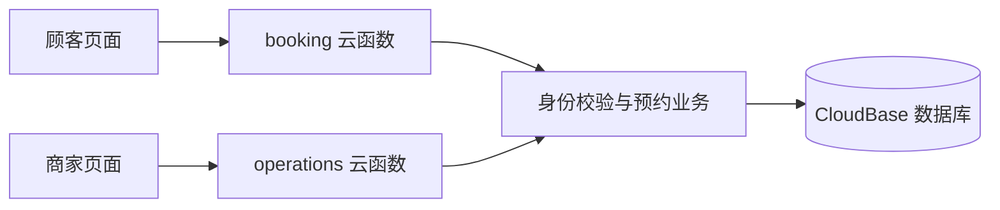

# 比例时代 · 微信预约小程序

面向单店、单服务提供者的预约管理 Demo。顾客选择服务与时间，店主在同一个小程序中查看预约、取消预约并管理接单日期。

项目使用原生微信小程序、TypeScript 和腾讯云 CloudBase，重点展示预约时段计算、事务一致性、身份鉴权与顾客／商家两种使用流程。

> 当前状态：主要功能已实现，本地 59 项测试通过；开发环境已部署并配置商家角色。商家完整流程和真机验收尚未完成。本项目用于学习与作品展示，当前服务、价格和联系方式包含示例数据。

## 功能一览

| 顾客端 · 6 个页面 | 商家端 · 4 个页面 |
| --- | --- |
| 服务列表与详情，展示时长和价格 | 工作台：今日有效预约、待开始预约和下一笔预约 |
| 按日期查询可预约时段 | 按日期查看预约列表与详情，包含取消记录 |
| 提交预约，查看预约结果 | 在预约开始前取消预约 |
| 查看个人预约与详情，开始前取消 | 关闭／恢复接单日期，保留已有预约 |

商家入口位于“我的预约”，仅向已配置商家角色的账号显示。入口隐藏之外，服务端仍逐次校验权限。

## 实现重点

- **防止时段冲突**：创建预约时在事务内检查并写入当天占用；本地测试覆盖 50 个重叠预约并发请求。
- **重复提交保护**：幂等记录保存请求与结果，支持网络异常后的重试。
- **关店不取消预约**：手动关闭标记与预约占用分离；恢复接单后重新计算实际可用时段。
- **明确区分日期状态**：休息日、未生成日程、手动关闭、约满、营业结束、暂无服务和无剩余合法时段分别处理。
- **可信身份与事务取消**：身份来自微信云函数上下文；取消预约同步释放占用并更新用户预约配额。
- **可核查的运维基础**：提供有界清理、占用一致性核对、预算阈值处理及发布配置检查。脚本存在不代表平台调度和告警已经配置。

## 技术与结构

- 界面：微信原生小程序 / WXML / WXSS
- 语言与构建：TypeScript / esbuild
- 云端：CloudBase 云函数与文档数据库
- 测试：Node.js Test Runner / 内存数据库 / 模拟微信与云管理接口



```text
miniprogram/       实际小程序入口、10 个页面、共享调用工具
server/            预约业务、商家业务、鉴权与数据库适配
shared/            共享类型
cloudfunctions/    两个业务云函数的构建输出与依赖配置
config/            门店、服务与环境配置
infra/             安全规则、索引和云函数配置
scripts/           构建、部署、初始化与维护工具
tests/            本地业务、页面和工具测试
docs/             开发、架构、进度与设计说明
```

根目录的旧模板文件保留作参考，实际小程序目录由 `project.config.json` 的 `miniprogramRoot` 指定。阅读顺序见 [代码导读](docs/ARCHITECTURE.md)。

## 本地运行

建议使用 Node.js 22（已验证版本 22.17.1）、npm 和微信开发者工具。

```sh
npm ci --ignore-scripts
npm run check
```

`check` 会构建运行文件、检查类型并执行本地测试；本地测试不需要真实云账号。构建后的 JavaScript 不作为主要源码维护。

先构建生成 project.config.json，再用微信开发者工具打开仓库根目录查看界面；预约等业务需要你自己的微信小程序 AppID、CloudBase 环境、初始化数据与云函数。示例标识为虚构值，exampleOnly 标记阻止运维脚本使用示例配置操作云端。

配置自有环境、生成日程和商家授权的步骤见 [开发与部署](docs/DEVELOPMENT.md)。修改 TypeScript 或展示配置后运行 `npm run build`；本地配置变化不会自动修改数据库。

## 当前验证情况

2026-09-18 重新执行类型检查与测试：**59 / 59 通过**。

开发环境历史实测已覆盖顾客预约／取消基础流程、未授权访问拒绝、商家资格查询与入口显示。商家取消后的两端同步、关店／恢复完整流程、真实云端并发和真机验证仍待完成；不以本地测试替代云端验收。

## 后续方向

1. 完成顾客与商家完整流程、权限隔离和真机验收。
2. 补齐真实门店配置、日程调度、清理、告警和备份恢复。
3. 再设计爽约、临近取消、预约限制及恢复规则。

当前不包含支付、定金、多门店、员工排班或 CRM。详细范围见 [路线图](docs/ROADMAP.md)。

## 文档导航

| 文档 | 用途 |
| --- | --- |
| [项目状态](docs/STATUS.md) | 已完成、已验证与尚未完成的边界 |
| [代码导读](docs/ARCHITECTURE.md) | 从入口理解顾客端、商家端和云函数 |
| [开发与部署](docs/DEVELOPMENT.md) | 本地构建、自有云环境及日常任务 |
| [商家端设计](docs/merchant-console-demo-spec.md) | 业务规则和验收标准 |
| [商家实现说明](docs/merchant-console-implementation.md) | 接口、权限配置与实现约定 |
| [本地测试记录](docs/merchant-console-local-test-report.md) | 测试覆盖与结果边界 |
| [路线图](docs/ROADMAP.md) | 下一阶段需求及待明确规则 |
| [运维说明](docs/RUNBOOK.md) | 发布门禁、预算、备份和故障处理 |
| [GitHub 发布准备](docs/GITHUB.md) | 上传范围、项目简介和公开前检查 |

本仓库尚未指定开源许可证。公开展示不等于授予任意使用、修改或分发授权；如需开源复用，应由作者选择并添加许可证。
